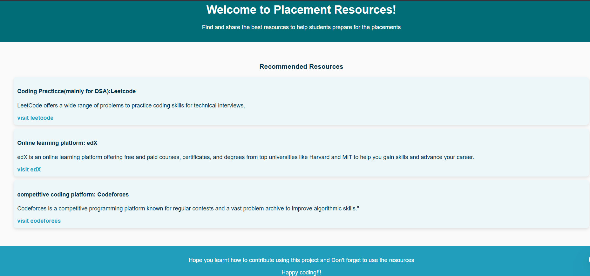

# Placement Resources

## 📌 What is This Project?

This project is a simple website that displays a collection of high-quality resources shared by contributors. It’s designed for:

* 🎓 Students preparing for placements
* 👩‍💻 Beginners learning to contribute to open source
* 🌱 First-time contributors looking for a “Good First Issue”

## Screenshots



## 🌐 Live Preview

https://varshitha713.github.io/good-first-issue-for-students/


## 🛠️ Tech Stack

* HTML
* CSS
* JavaScript
* Git & GitHub (for collaboration)


## 🧑‍💻 How to Contribute

📌 What to Add!?

Contributors are expected to add a simple card that contains:

* A link to a useful placement-related resource (e.g., DSA, Web Dev, Aptitude, etc.)

* A short description explaining what the link offers
  check [index.html](index.html) for the structure of the card
  
* You can also raise issues regarding the webpage design and work on them

* Don't forget to add a category to the card for filtering. Feel free to add new categories if wanted

These cards will appear on the main page to help students easily explore resources.
Want to add a resource?

1. **Fork** this repository
2. **Clone** the forked repo
3. Add your resource link and a short description in the correct section (like `DSA`, `Web Dev`, `CS Fundamentals`, etc.)
4. Commit your changes: `git commit -m "Added new DSA resource"`
5. Push to your fork: `git push origin main`
6. Open a **Pull Request** with a proper title and description

For detailed steps, check [`CONTRIBUTING.md`](./CONTRIBUTING.md)


## 🧭 File Structure

```
placement-resources/
├── images/
│   └── prjct-preview.png
├── styles/
│   └── style.css
├── index.html
├── README.md
├── contributing.md
├── LICENSE

```


## 🫶 Motivation

This project was created as a part of my submission for **Social Summer of Code 2025** as a Project Admin. I wanted to build something that:

* Helps fellow students
* Teaches open source contribution basics
* Has a clean, minimal design


## 📄 License

This project is licensed under the MIT License — see the LICENSE file for details.

## 💡 Maintainer

Made with ❤️ by Macha Varshitha. Open for suggestions and contributions!

